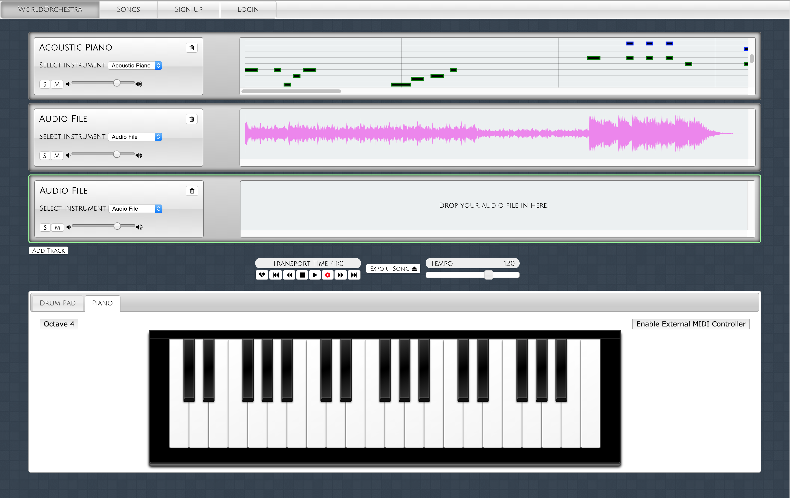

# WorldOrchestra

[ ](https://codeship.com/projects/62739)

[](https://codeclimate.com/github/WorldOrchestra/WorldOrchestra)

Bringing the world together - one track at a time.


## Table of Contents

1. [Team](#team)
1. [Requirements](#requirements)
    1. [Installing Dependencies](#installing-dependencies)
1. [Usage](#Usage)
    1. [Tasks](#tasks)
1. [Development](#development)
1. [Contributing](#contributing)

## Team

  - __Product Owner__: Dave Fedele
  - __Scrum Master__: Albert Lee
  - __Development Team Members__: Domen Vajevec, Tyler Davis

## Requirements

- Node
- MongoDB
- Grunt
- Bower

### Installing Dependencies

From within the root directory:

```sh
npm install
bower install
cd test
bower install
```

## Usage

From the root directory run: 

- `grunt` : Runs jshint, tests and builds the project.
- `grunt build` : Builds the project. All production ready files are stored in the `dist` directory.
- `grunt serve` : Runs a local server for a preview of the site using the original files. 
- `grunt serve:dist` : Builds the project and runs a server locally for a preview of the site using the concatenated and uglified files. 
- `grunt serve:test` : Runs a local server and opens the test file for Mocha, Chai, and Sinon.
- `grunt test` : Runs a local server and opens the test files for Casper.

## Development

All development is done in the public or server folders.  Running `grunt` or `grunt build` will build your project into the `dist` folder.  Use the `dist` folder for pushing to a production server.

### Roadmap

View the project roadmap [here](https://github.com/WorldOrchestra/WorldOrchestra/issues)

[](https://waffle.io/worldorchestra/worldorchestra)

## Contributing

See [CONTRIBUTING.md](CONTRIBUTING.md) for contribution guidelines.

## Resources

[Tone.js](https://github.com/TONEnoTONE/Tone.js/)<br/> 
[midi-js-soundfonts](https://github.com/gleitz/midi-js-soundfonts)<br/> 
[Recorderjs](https://github.com/mattdiamond/Recorderjs)<br>
[wavesurfer.js](https://github.com/katspaugh/wavesurfer.js)<br>
[backbone.modal](https://github.com/awkward/backbone.modal)<br>

http://blog.dirk-eisenberg.de/2014/12/21/deploy-angularjs-apps-to-azure-websites-with-codeship/
http://bl.ocks.org/hunzy/11110940
